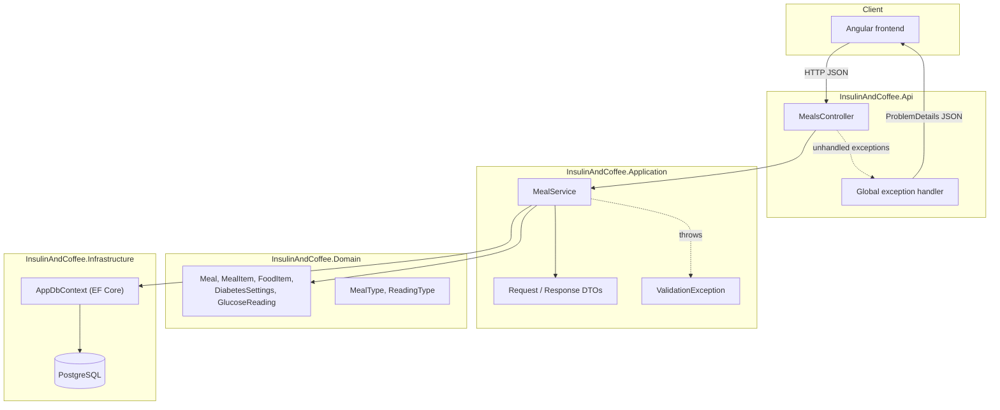
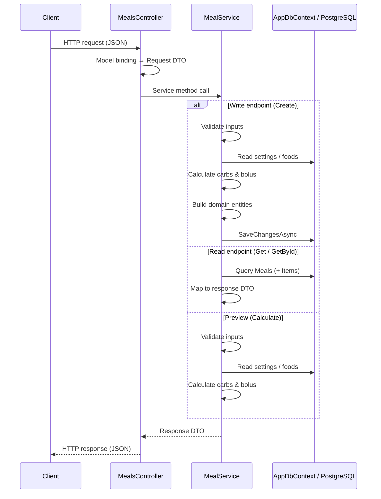
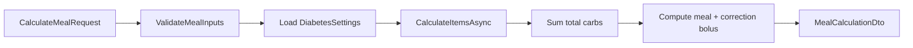
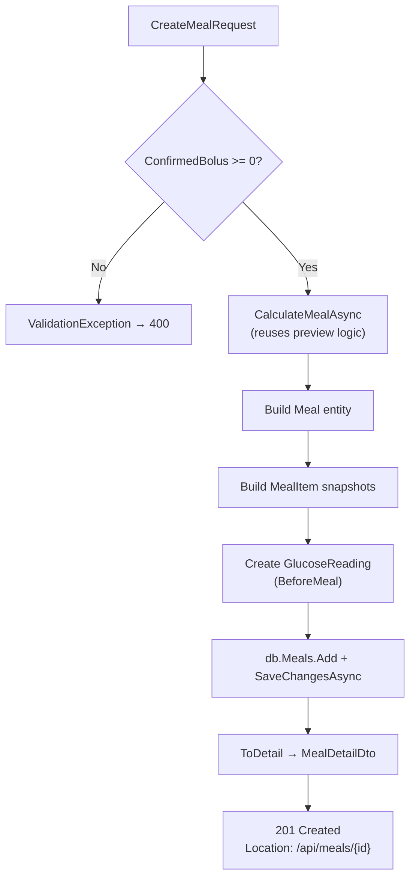
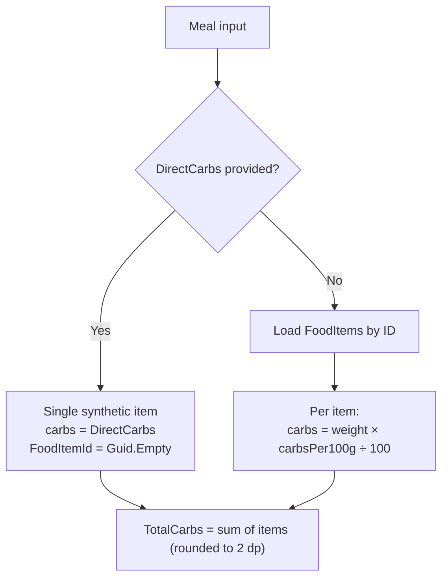

# Meals API — Architecture & Request Flow

This document traces the complete lifecycle of the **Meals API** in Insulin & Coffee: from HTTP entry at `MealsController` through application services, domain entities, database persistence, and response mapping.

The Meals API supports **carbohydrate estimation**, **insulin bolus suggestions** (based on user diabetes settings), and **meal history** for a single hardcoded user. It is a diabetes-support feature, not medical advice.

---

## Table of Contents

1. [Overview](#overview)
2. [Architecture](#architecture)
3. [API Endpoints](#api-endpoints)
4. [Request Lifecycle](#request-lifecycle)
5. [Layer-by-Layer Breakdown](#layer-by-layer-breakdown)
6. [Business Logic: Carb & Bolus Calculation](#business-logic-carb--bolus-calculation)
7. [Database Interaction](#database-interaction)
8. [Error Handling & HTTP Status Codes](#error-handling--http-status-codes)
9. [Summary](#summary)

---

## Overview

| Aspect | Detail |
|--------|--------|
| **Controller** | `InsulinAndCoffee.Api.Controllers.MealsController` |
| **Service** | `InsulinAndCoffee.Application.Services.MealService` |
| **Persistence** | EF Core via `IAppDbContext` → `AppDbContext` (PostgreSQL) |
| **Repository pattern** | Not used — the service queries `DbSet<T>` directly |
| **Validation** | In-service checks throwing `ValidationException` (no FluentValidation) |
| **Mapping** | Private static methods in `MealService` (`ToSummary`, `ToDetail`) |
| **Authentication** | None — all queries scoped to `DefaultUser.Id` |

### Endpoints at a Glance

| Method | Route | Purpose | Response |
|--------|-------|---------|----------|
| `POST` | `/api/meals/calculate` | Preview carbs and suggested bolus without saving | `MealCalculationDto` (200) |
| `POST` | `/api/meals` | Persist a logged meal with items and glucose reading | `MealDetailDto` (201) |
| `GET` | `/api/meals` | List meal history with optional filters | `MealSummaryDto[]` (200) |
| `GET` | `/api/meals/{id}` | Retrieve a single meal with line items | `MealDetailDto` (200) |

---

## Architecture

The Meals API follows a layered design consistent with the rest of the backend:



### Dependency Injection

| Component | Lifetime | Registered in |
|-----------|----------|---------------|
| `MealService` | Scoped | `Application/DependencyInjection.cs` |
| `IAppDbContext` → `AppDbContext` | Scoped | `Infrastructure/DependencyInjection.cs` |
| `TimeProvider` | Singleton | `Application/DependencyInjection.cs` |

`MealsController` receives `MealService` via primary-constructor injection.

---

## API Endpoints

### Controller Entry Point

```csharp
[ApiController]
[Route("api/[controller]")]
public class MealsController(MealService mealService) : ControllerBase
```

`[ApiController]` enables automatic model validation for bound request bodies and consistent 400 responses for binding failures. The controller is intentionally thin: it delegates all business logic to `MealService` and returns standard ASP.NET Core result types (`Ok`, `CreatedAtAction`).

| Action | Delegates to | HTTP result |
|--------|--------------|-------------|
| `Calculate` | `CalculateMealAsync` | `200 OK` |
| `Create` | `CreateMealAsync` | `201 Created` with `Location` header |
| `Get` | `GetMealsAsync` | `200 OK` |
| `GetById` | `GetMealAsync` | `200 OK` |

---

## Request Lifecycle

### High-Level Flow (All Endpoints)



---

### 1. `POST /api/meals/calculate` — Preview Calculation

**Purpose:** Let the user preview total carbs, meal bolus, correction bolus, and suggested bolus **before** committing a meal record.



| Step | Responsibility |
|------|----------------|
| Model binding | Deserialize `CalculateMealRequest` from JSON body |
| `ValidateMealInputs` | Ensure glucose > 0; either direct carbs > 0 or at least one food item with weight > 0 |
| Load settings | Read `DiabetesSettings` for `DefaultUser` (carb ratio, target glucose, correction factor) |
| `CalculateItemsAsync` | Resolve carbs per item — from `FoodItem` records or a direct-carb shortcut |
| Bolus math | `mealBolus = totalCarbs / carbRatio`; correction only if pre-meal glucose exceeds target |
| Response | `MealCalculationDto` with breakdown per item |

**No database write occurs.**

---

### 2. `POST /api/meals` — Create Meal

**Purpose:** Persist a logged meal, including calculated values, user-confirmed bolus, food snapshots, and an associated pre-meal glucose reading.



| Step | Responsibility |
|------|----------------|
| Confirmed bolus check | User-entered insulin units must not be negative |
| Recalculate | Calls `CalculateMealAsync` internally so stored values always match preview logic |
| Entity assembly | Creates `Meal` with nested `MealItem` and `GlucoseReading` collections |
| Snapshot fields | Copies food name and `CarbsPer100g` at log time — historical accuracy if foods change later |
| Timestamps | `MealTime` defaults to `TimeProvider.GetUtcNow()` when omitted |
| Persistence | Single `SaveChangesAsync` inserts meal, items, and glucose reading (cascade) |
| Response | `CreatedAtAction` returns `MealDetailDto` with `201` and `Location` header |

---

### 3. `GET /api/meals` — List Meals

**Purpose:** Return meal history for the default user, optionally filtered by meal type or food name search.

| Query parameter | Effect |
|---------------|--------|
| `search` | Case-insensitive match against `MealItem.FoodNameSnapshot` |
| `mealType` | Filter by `MealType` enum (`Breakfast`, `Lunch`, `Dinner`, `Snack`) |

| Step | Responsibility |
|------|----------------|
| Base query | `Meals` where `UserId == DefaultUser.Id`, includes `Items` |
| Filtering | Optional `mealType` and `search` predicates |
| Ordering | `MealTime` descending (most recent first) |
| Mapping | `ToSummary` → `MealSummaryDto` (food names only, no per-item detail) |
| Tracking | `AsNoTracking()` — read-only, no change tracking overhead |

---

### 4. `GET /api/meals/{id}` — Get Meal by ID

**Purpose:** Retrieve full detail for one meal including all line items.

| Step | Responsibility |
|------|----------------|
| Query | `Meals` with `Items`, filtered by `id` and `DefaultUser.Id` |
| Not found | Throws `KeyNotFoundException` → global handler returns `404` |
| Mapping | `ToDetail` → `MealDetailDto` with ordered `MealItemDto` list |

---

## Layer-by-Layer Breakdown

### Request Models (DTOs)

Defined in `InsulinAndCoffee.Application.Dtos` (`CommonDtos.cs`):

| DTO | Used by | Key fields |
|-----|---------|------------|
| `CalculateMealRequest` | `POST /calculate` | `MealType`, `PreMealGlucose`, `Items`, optional `DirectCarbs`, `DirectFoodName` |
| `CreateMealRequest` | `POST /api/meals` | Same as calculate + `MealTime?`, `ConfirmedBolus`, `Notes` |
| `MealItemInputDto` | Nested in requests | `FoodItemId`, `WeightGrams` |

`DirectCarbs` enables a **delivery-meal shortcut**: when set, the service skips food-item lookup and treats carbs as a single synthetic line item (useful for lazy/delivery meals with known total carbs).

### Validation

There are **no separate validator classes** (no FluentValidation). Validation is performed inside `MealService`:

| Rule | Method | Error message |
|------|--------|---------------|
| Pre-meal glucose > 0 | `ValidateMealInputs` | "Pre-meal glucose must be greater than zero." |
| Direct carbs > 0 (when used) | `ValidateMealInputs` | "Direct carbs must be greater than zero." |
| At least one food item (when no direct carbs) | `ValidateMealInputs` | "Add at least one food item." |
| Food weight > 0 | `ValidateMealInputs` | "Food weights must be greater than zero." |
| All food IDs exist for user | `CalculateItemsAsync` | "One or more selected foods were not found." |
| Confirmed bolus ≥ 0 | `CreateMealAsync` | "Confirmed bolus cannot be negative." |

Failures throw `ValidationException`, which the global handler maps to **400 Bad Request**.

ASP.NET `[ApiController]` additionally validates that required JSON fields bind correctly (e.g., enum values, numeric types).

### Application Service (`MealService`)

`MealService` is the **single orchestrator** for all meal use cases. It:

- Owns carb and bolus calculation logic
- Queries and persists via `IAppDbContext`
- Maps domain entities to response DTOs
- Scopes all data access to `DefaultUser.Id`

| Method | Reads DB | Writes DB |
|--------|----------|-----------|
| `CalculateMealAsync` | `DiabetesSettings`, `FoodItems` | No |
| `CreateMealAsync` | Same as calculate | `Meals`, `MealItems`, `GlucoseReadings` |
| `GetMealsAsync` | `Meals`, `MealItems` | No |
| `GetMealAsync` | `Meals`, `MealItems` | No |

### Repository Layer

**Not present.** The project uses `IAppDbContext` as a thin abstraction over EF Core `DbSet<T>`. `MealService` writes LINQ queries directly against `db.Meals`, `db.FoodItems`, and `db.DiabetesSettings`.

### Domain Entities

| Entity | Role in Meals flow |
|--------|-------------------|
| `Meal` | Root aggregate: meal metadata, totals, bolus values, timestamps |
| `MealItem` | Line item with **snapshot** fields (`FoodNameSnapshot`, `CarbsPer100gSnapshot`) |
| `FoodItem` | Source of truth for carbs-per-100g during calculation (not mutated) |
| `DiabetesSettings` | User insulin parameters: `CarbRatio`, `TargetGlucose`, `CorrectionFactor` |
| `GlucoseReading` | Auto-created on meal log with `ReadingType.BeforeMeal` |

#### Enums

| Enum | Values used |
|------|-------------|
| `MealType` | `Breakfast`, `Lunch`, `Dinner`, `Snack` |
| `ReadingType` | `BeforeMeal` (set on create) |

### Mapping

Mapping is **inline** in `MealService` — no AutoMapper:

| Method | Target DTO | Notes |
|--------|------------|-------|
| `ToSummary` | `MealSummaryDto` | Food names as `string[]`; used for list views |
| `ToDetail` | `MealDetailDto` | Full `MealItemDto` list, sorted by food name |
| `CalculateItemsAsync` | `CalculatedMealItemDto` | Intermediate calculation result |

### Response Models

| DTO | Returned by | Contents |
|-----|-------------|----------|
| `MealCalculationDto` | `POST /calculate` | `TotalCarbs`, `MealBolus`, `CorrectionBolus`, `SuggestedBolus`, `Items[]` |
| `CalculatedMealItemDto` | Nested in calculation | Per-item carb breakdown before save |
| `MealDetailDto` | `POST /api/meals`, `GET /{id}` | Full meal + `MealItemDto[]` + `CreatedAt` |
| `MealSummaryDto` | `GET /api/meals` | Summary fields + `FoodNames[]` (no item IDs) |
| `MealItemDto` | Nested in detail | Snapshot fields + calculated carbs |

---

## Business Logic: Carb & Bolus Calculation

### Carb Calculation

Two input modes are supported:



### Bolus Calculation

Uses seeded `DiabetesSettings` (defaults: target `6.5`, carb ratio `10`, correction factor `3`):

| Value | Formula |
|-------|---------|
| **Meal bolus** | `totalCarbs / carbRatio` |
| **Correction bolus** | `(preMealGlucose - targetGlucose) / correctionFactor` — only when pre-meal glucose **exceeds** target; otherwise `0` |
| **Suggested bolus** | `mealBolus + correctionBolus` |

All values are rounded to 2 decimal places. The **confirmed bolus** is user-provided at create time and stored as-is; it may differ from the suggestion.

> **Safety note:** Suggested bolus is an estimate based on saved settings. The API stores both suggested and confirmed values so the user can override.

---

## Database Interaction

### Tables Involved

| Table | EF `DbSet` | Operations |
|-------|------------|------------|
| `Meals` | `db.Meals` | INSERT (create), SELECT (list/get) |
| `MealItems` | `db.MealItems` | INSERT via cascade on `Meal.Items` |
| `GlucoseReadings` | `db.GlucoseReadings` | INSERT via cascade on `Meal.GlucoseReadings` |
| `FoodItems` | `db.FoodItems` | SELECT (calculate/create) |
| `DiabetesSettings` | `db.DiabetesSettings` | SELECT (calculate/create) |

### EF Core Configuration Highlights

Configured in `AppDbContext.OnModelCreating`:

| Entity | Notable constraints |
|--------|---------------------|
| `Meal` | Index on `(UserId, MealTime)`; decimal precision on glucose/carb/bolus fields |
| `MealItem` | Cascade delete from `Meal`; snapshot string max 160 chars |
| `GlucoseReading` | `MealId` set-null on meal delete; index on `(UserId, ReadingTime)` |
| `FoodItem` | Index on `(UserId, Name)` |

### Connection & Migrations

- **Provider:** PostgreSQL via `Npgsql`
- **Connection string:** `DefaultConnection` from configuration
- **Migrations:** Applied automatically on startup in `Program.cs`

---

## Error Handling & HTTP Status Codes

Global exception middleware in `Program.cs` converts unhandled exceptions to `ProblemDetails` JSON:

| Exception | HTTP status | When |
|-----------|-------------|------|
| `ValidationException` | 400 Bad Request | Invalid input (glucose, weights, missing foods, negative bolus) |
| `KeyNotFoundException` | 404 Not Found | Meal ID not found for default user |
| Other | 500 Internal Server Error | Unexpected failures (e.g., missing diabetes settings row) |

Model binding failures (invalid JSON, unknown enum) are handled by `[ApiController]` before the service is invoked.

---

## Summary

### 1. Overall Responsibility

The Meals API is the **core meal-logging and insulin-estimation** surface of Insulin & Coffee. It:

- Estimates carbohydrates from food items or direct carb entry
- Suggests insulin bolus based on personal diabetes settings
- Persists meal history with immutable food snapshots
- Records an associated pre-meal glucose reading
- Exposes searchable meal history for the Angular frontend

### 2. External Dependencies

| Dependency | Purpose |
|------------|---------|
| **PostgreSQL** | Persistent storage for meals, items, foods, settings, glucose readings |
| **EF Core (`AppDbContext`)** | ORM and unit of work (`SaveChangesAsync`) |
| **`DiabetesSettings`** | Carb ratio, target glucose, correction factor for bolus math |
| **`FoodItem` catalog** | Carbs-per-100g lookup during item-based calculation |
| **`TimeProvider`** | UTC timestamps for `MealTime` and `CreatedAt` |
| **`DefaultUser`** | Hardcoded `UserId` — all data scoped to a single seeded user |
| **Angular frontend** | Primary consumer via CORS-enabled REST calls |

### 3. Two Biggest Risks When Modifying This Flow

| Risk | Why it matters |
|------|----------------|
| **Breaking bolus/carb calculation consistency** | `CreateMealAsync` reuses `CalculateMealAsync`. A change to calculation logic affects both the preview endpoint and every persisted meal. Frontend users rely on preview matching what gets saved. |
| **Snapshot vs. live food data confusion** | `MealItem` stores `FoodNameSnapshot` and `CarbsPer100gSnapshot` at log time. Editing `FoodItem` records does not retroactively change historical meals. Developers may accidentally query live `FoodItem` data when displaying history. |

### 4. What a New Developer Should Understand Before Making Changes

1. **No repository layer** — queries live in `MealService`. Extract carefully if the service grows.
2. **Validation is in the service**, not in FluentValidation or controller attributes (beyond `[ApiController]` binding).
3. **Single-user assumption** — `DefaultUser.Id` is hardcoded everywhere. Adding authentication requires touching every query filter.
4. **Calculate-before-create pattern** — the create path always recalculates; do not duplicate math in the controller or frontend-only.
5. **Direct carbs mode** — delivery/lazy meals bypass `FoodItem` lookup; `FoodItemId` is `Guid.Empty` in that path.
6. **Medical-adjacent safety** — suggested bolus is an estimate; confirmed bolus is user-owned. Wording and logic should remain traceable and overridable.
7. **No dedicated MealService tests yet** — manual or automated verification of calculation edge cases is important before changing formulas.

---

## File Reference

| Layer | Path |
|-------|------|
| Controller | `backend/src/InsulinAndCoffee.Api/Controllers/MealsController.cs` |
| Service | `backend/src/InsulinAndCoffee.Application/Services/MealService.cs` |
| DTOs | `backend/src/InsulinAndCoffee.Application/Dtos/CommonDtos.cs` |
| DbContext abstraction | `backend/src/InsulinAndCoffee.Application/Abstractions/IAppDbContext.cs` |
| EF Core context | `backend/src/InsulinAndCoffee.Infrastructure/AppDbContext.cs` |
| Domain entities | `backend/src/InsulinAndCoffee.Domain/Entities/` |
| Exception handling | `backend/src/InsulinAndCoffee.Api/Program.cs` |
| DI registration | `Application/DependencyInjection.cs`, `Infrastructure/DependencyInjection.cs` |

---

*Last updated: July 2026*
